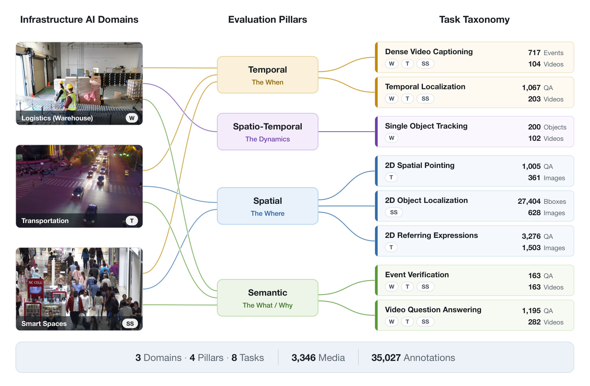

<h1 align="center">VANTAGE-Bench</h1>

<p align="center">
  <b>V</b>ideo <b>AN</b>alysis <b>T</b>asks <b>A</b>cross <b>G</b>eneralized <b>E</b>nvironments
</p>

<p align="center">
  <a href="https://huggingface.co/datasets/anonymous/VANTAGE-Bench"></a>
  <a href="CHANGELOG.md"></a>
  <a href="LICENSE"></a>
  
</p>

<p align="center">
  <a href="https://huggingface.co/datasets/anonymous/VANTAGE-Bench"><b>Dataset</b></a> ·
  <a href="#documentation-index"><b>Docs</b></a> ·
  <a href="CHANGELOG.md"><b>Changelog</b></a>
</p>

**VANTAGE-Bench** is a multi-task benchmark for evaluating Vision-Language Models on fixed-camera footage captured in operational environments: warehouses, transportation and smart spaces. This repository is the official harness. You run your model here, package the predictions, and upload them to the submission portal for scoring.

## News

- **[2026-10-06]** Harness v1.1.0: native Gemini support, agentic skills, submission validation, faster DVC scoring. See the [changelog](CHANGELOG.md).
- **[2026-09-30]** Packaging works from any run mode, and `run.py` ends with a status table for every model and dataset.
- **[2026-08-19]** Agentic skills: a coding agent can now run the whole pipeline, from data preparation to the portal form.
- **[2026-07-26]** Native support for Gemini 3.6 Flash and Gemini 3.5 Flash-Lite.

<details>
<summary>Earlier news</summary>

- **[2026-07-21]** The leaderboard reaches 17 models with Gemini 3.6 Flash and Gemini 3.5 Flash-Lite.
- **[2026-06-21]** The harness reads the public `anonymous/VANTAGE-Bench` dataset layout directly.
- **[2026-05-27]** Harness v1.0.0 released and the leaderboard goes live.
- **[2026-04-24]** The VANTAGE-Bench dataset is released on Hugging Face.

</details>

Every release is described in [`CHANGELOG.md`](CHANGELOG.md).

## Contents

- [About VANTAGE-Bench](#about-vantage-bench)
- [Quick Start](#quick-start)
- [End-to-End Flow](#end-to-end-flow)
- [Benchmarks](#benchmarks)
- [Supported Models](#supported-models)
- [Installation](#installation)
- [Dataset Setup](#dataset-setup)
- [Running Evaluations](#running-evaluations)
- [All Registered Dataset Names](#all-registered-dataset-names)
- [Submission Workflow](#submission-workflow)
- [Model Backends](#model-backends)
- [Output Structure](#output-structure)
- [Prediction File Schemas](#prediction-file-schemas)
- [Hardware Requirements](#hardware-requirements)
- [Repository Layout](#repository-layout)
- [Documentation Index](#documentation-index)
- [For Maintainers](#for-maintainers)
- [Built on VLMEvalKit](#built-on-vlmevalkit)
- [Citation](#citation)

## About VANTAGE-Bench

VANTAGE-Bench is a multi-task benchmark for Real-World Video Understanding, designed to evaluate Vision-Language Models on fixed-camera footage captured in operational environments.

The benchmark spans three deployment domains, **Warehouse**, **Transportation** and **Smart Spaces**, and evaluates model capability across four complementary pillars of video intelligence.

Unlike benchmarks built around curated internet media or short trimmed clips, VANTAGE-Bench emphasizes the perceptual and reasoning capabilities required for real-world Infrastructure AI systems, including localization, tracking, temporal reasoning, and grounded understanding of events.

<p align="center">
  
</p>

### Tasks and Primary Metrics

| Pillar | What it measures | Task | Primary metric |
|--------|------------------|------|----------------|
| **I · Semantic** | High-level video understanding | Event Verification | Macro F1 |
| **I · Semantic** | High-level video understanding | Video Question Answering | Accuracy |
| **II · Spatial** | 2D scene understanding | 2D Referring Expressions | mIoU (best predicted box per item), with Acc@0.25/0.5/0.75 |
| **II · Spatial** | 2D scene understanding | 2D Spatial Pointing | Accuracy |
| **II · Spatial** | 2D scene understanding | 2D Object Localization (Astro2D) | F1@0.5 (precision, recall and F1 at IoU 0.5; no mAP is computed) |
| **III · Temporal** | Event timing and temporal reasoning | Temporal Localization | mIoU |
| **III · Temporal** | Event timing and temporal reasoning | Dense Video Captioning | SODA_c |
| **IV · Spatio-Temporal** | Tracking and spatial reasoning over time | Single Object Tracking | Success AUC |

## Quick Start

```bash
# 1. Clone and install (Python 3.10+ required)
git clone https://github.com/anon-benchmark/VANTAGE-bench.git
cd VANTAGE-Bench
conda create -n vantage python=3.10 -y && conda activate vantage
conda install -c conda-forge ffmpeg -y          # required for VANTAGE-SOT
pip install -r requirements.txt && pip install -e .

# 2. Download benchmark data from HuggingFace
hf auth login                                   # once — needed for SOT data
python scripts/run_lmudata.py --all --lmu-root ~/LMUData

# 3. Run inference + evaluation (produces predictions and submission files)
export LMUData=~/LMUData
export OPENAI_API_KEY=<your-key>                # if using an API model
python run.py \
  --data VANTAGE_VQA_8frame \
  --model GPT4o \
  --work-dir ./outputs

# 4. Validate, package and submit
python scripts/validate_submission.py --work-dir ./outputs/<model>/<eval_id>
python scripts/package_submission.py --work-dir ./outputs/<model>/<eval_id> --out submission.tar.gz
# Upload submission.tar.gz at <submission-portal-url>
```

> [!NOTE]
> Ground truth is withheld from the public dataset. A local run writes submission files and no leaderboard metrics; scoring happens on the server after you upload.

- **Data prep guide:** [`scripts/RUN_LMUData.md`](scripts/RUN_LMUData.md) covers all tasks, options, troubleshooting, and the SOT and grounding prerequisites.
- **Prompt formats:** [`prompt_guide.md`](prompt_guide.md) documents the exact prompt templates used for each benchmark.
- **Using a coding agent?** [`skills/README.md`](skills/README.md) lists playbooks that run every step above for you.

## End-to-End Flow

This section traces what happens from a fresh clone to a submitted result.

```
git clone / pip install
        │
        ▼
scripts/run_lmudata.py                 downloads anonymous/VANTAGE-Bench from HF
        │                              reshapes into LMUData/datasets/<Task>/ layout
        │                              (symlinks media into ~/.cache/huggingface/)
        ▼
export LMUData=~/LMUData
        │
        ▼
python run.py                          builds dataset object → calls dataset.prepare_dataset()
        │                              loads TSV from LMUData/datasets/<Task>/<Task>.tsv
        │                              for each row: calls dataset.build_prompt()
        │                                 → packages video/image paths + question text
        │                              feeds prompt to model → gets raw prediction string
        │                              writes predictions to outputs/<model>/<eval_id>/<model>_<task>.xlsx
        │
        ▼
dataset.evaluate(result_file)          called at end of run.py (skipped in --mode infer)
        │                              calls emit_submission() in vlmeval/dataset/utils/vantagebench/
        │                              writes outputs/<model>/<eval_id>/<model>_<task>_submission.jsonl
        │                              (no local leaderboard metrics — GT is withheld from public dataset)
        ▼
scripts/package_submission.py          collects all *_submission.jsonl files from the output dir
        │                              renames them to canonical task names (vqa.jsonl, temporal.jsonl, …)
        │                              bundles into submission.tar.gz
        ▼
upload submission.tar.gz               to <submission-portal-url>
                                       scores emailed back; 2 submissions/day · 30 lifetime
```

<details>
<summary><b>Key code paths per task</b></summary>

| Task | Dataset class | Prompt built in | Evaluator / emitter |
|------|--------------|-----------------|---------------------|
| VQA | `vantage_vqa.py` → `VANTAGE_VQA` | `build_prompt()` | `evaluate()` → `adapter_vqa.py` |
| Temporal | `vantage_temporal.py` → `VANTAGE_Temporal` | `build_prompt()` | `evaluate()` → `adapter_temporal.py` |
| DVC | `vantage_dvc.py` → `VANTAGE_DVC` | `build_prompt()` | `evaluate()` → `adapter_dvc.py` |
| EventVerification | `vantage_event_verification.py` → `VANTAGE_EventVerification` | `build_prompt()` | `evaluate()` → `adapter_event_verification.py` |
| SOT | `vantage_sot.py` → `VANTAGE_SOT` | `build_prompt()` | `evaluate()` → `adapter_sot.py` |
| 2DGrounding | `vantage2d/grounding_2d_dataset.py` | `build_prompt()` | `evaluate()` → `adapter_grounding.py` |
| 2DPointing | `image_mcq.py` → `VANTAGE_2DPointing` | `build_prompt()` (MCQ over candidate points) | `evaluate()` → `adapter_pointing.py` |
| Astro2D | `vantage2d/astro_2d_dataset.py` | `build_prompt()` | `evaluate()` → `adapter_astro.py` |

</details>

## Benchmarks

VANTAGE covers eight tasks across video and image modalities. Each benchmark is independently runnable.

### Video Benchmarks

| Benchmark | Task | Metrics | Dataset key (example) |
|-----------|------|---------|----------------------|
| **VANTAGE-VQA** | Multiple-choice video question answering | Accuracy | `VANTAGE_VQA_8frame` |
| **VANTAGE-Temporal** | Temporal event localization | mIoU, Precision@0.5 | `VANTAGE_Temporal_8frame` |
| **VANTAGE-DVC** | Dense video captioning | SODA_c, mIoU, IoU-F1, BERTScore-F1 | `VANTAGE_DVC_8frame` |
| **VANTAGE-EventVerification** | Binary event physics verification (Yes/No) | Macro F1, Accuracy, Balanced Accuracy | `VANTAGE_EventVerification_8frame` |
| **VANTAGE-SOT** | Single-object tracking across frames | Success AUC, mIoU, Precision@0.5 | `VANTAGE_SOT` |

### Image Benchmarks

| Benchmark | Task | Metrics | Dataset key |
|-----------|------|---------|-------------|
| **VANTAGE-2DGrounding** | Referring expression grounding | mIoU, Acc@0.5, Acc@0.25, Acc@0.75 (per item, the best IoU over all predicted boxes against any GT box is used) | `VANTAGE_2DGrounding` |
| **VANTAGE-2DPointing** | Spatial pointing (multiple-choice) | Accuracy | `VANTAGE_2DPointing` |
| **Astro2D** | Person detection on aerial imagery | F1@0.5 (primary), Precision@0.5, Recall@0.5, F1@0.95, mean F1 over IoU 0.5:0.05:0.95 | `Astro2D` |

All dataset keys and their frame/fps variants are listed in [All Registered Dataset Names](#all-registered-dataset-names).

## Supported Models

Pass any key of `supported_VLM` in [`vlmeval/config.py`](vlmeval/config.py) as `--model`. The families below are the ones used for the leaderboard; every model that VLMEvalKit supports is also available.

| Family | Example `--model` keys | Backend | Sample config |
|--------|------------------------|---------|---------------|
| **NVIDIA Cosmos** | `Cosmos3-Nano`, `Cosmos-Reason2-8B`, `Cosmos-Reason2-32B`, `Cosmos-Reason1-7B`, `Cosmos-Reason2-8B-HF`, `Cosmos-Reason2-8B-API` | HuggingFace, vLLM, API | [`configs/`](configs/README.md) |
| **Google Gemini** | `GeminiFlash3-6`, `GeminiFlash3-5-Lite`, `GeminiPro3-1`, `GeminiFlash3-1-Lite` | API (`GEMINI_API_KEY` or `GOOGLE_API_KEY`) | — |
| **Qwen** | `Qwen3-VL-8B-Instruct`, `Qwen3-VL-32B-Instruct`, `Qwen3.5-9B`, `Qwen3.5-27B` | vLLM (default), HuggingFace | — |
| **OpenAI** | `GPT4o` | API (`OPENAI_API_KEY`) | [`configs/gpt4o.json`](configs/gpt4o.json) |

To list every registered model name:

```bash
python -c "from vlmeval.config import supported_VLM; print(list(supported_VLM.keys()))"
```

To add your own model, see [Model Backends](#model-backends) and the registration section of [`docs/vantage/DEVELOPER_GUIDE.md`](docs/vantage/DEVELOPER_GUIDE.md). GPU and package requirements for each sample config are in [`configs/README.md`](configs/README.md).

## Installation

```bash
# Python 3.10 or later required
conda create -n vantage python=3.10 -y
conda activate vantage

# ffmpeg is required for VANTAGE-SOT frame extraction
conda install -c conda-forge ffmpeg -y

# Install dependencies
pip install -r requirements.txt
pip install -e .

# Optional: vLLM backend for local model inference
pip install vllm
```

<details>
<summary><b>Possible issues and solutions</b></summary>

- **Pip reports an ANTLR dependency conflict.** OmegaConf requires
  `antlr4-python3-runtime==4.9.3`, while the optional HiPhO benchmark's
  `math-verify` dependency requires ANTLR 4.13. Install the repository's
  current `requirements.txt` for the base environment. If you need HiPhO,
  use a separate environment for its dependencies.
- **A native extension fails to compile.** Check the compiler version and the
  package's error message. If it requires a newer C/C++ compiler, select one
  supported by that package and rerun the install with `CC` and `CXX` set to
  its compiler paths. A compiler upgrade is unnecessary when wheel installation
  succeeds.
- **`pip check` says `decord 0.6.0 is not supported on this platform`.** Try
  `python -c 'import decord; print(decord.__version__)'`. This warning was
  observed even when decord imported successfully; if the import fails, install
  a decord build compatible with your Python version and operating system.

</details>

## Dataset Setup

### Download from HuggingFace (recommended)

The benchmark data is hosted at [`anonymous/VANTAGE-Bench`](https://huggingface.co/datasets/anonymous/VANTAGE-Bench). Use the provided prep script to download and reshape it into the layout VLMEvalKit expects:

```bash
# Prepare all eight tasks (symlink mode — disk-efficient)
hf auth login                    # one-time setup; required for SOT data
python scripts/run_lmudata.py --all --lmu-root ~/LMUData
```

To skip the large SOT download (~16 GB), prepare individual tasks:

```bash
python scripts/run_lmudata.py \
  --tasks vqa,event_verification,dvc,temporal,pointing,astro2d,grounding \
  --lmu-root ~/LMUData
```

Full documentation, prerequisites (ffmpeg, gdown), troubleshooting, and advanced options are in **[`scripts/RUN_LMUData.md`](scripts/RUN_LMUData.md)**.

<details>
<summary><b>Source layout for EventVerification and 2DPointing</b></summary>

The prep script reads these two tasks directly from the public release layout. Each has
been published in two equivalent layouts and a given dataset revision ships one of them;
the script uses whichever is present:

- **EventVerification** - either a flat `data/event_verification/data_jsons/annotations/*.json`
  directory, or per-group `test_annotation*.json` files under
  `data/event_verification/filtered/**`. In the `filtered/` layout the item list inside each
  file is wrapped under a single (dataset-named) top-level key and each item's `video` path is
  resolved **relative to its own annotation file's directory** - videos are in nested
  subtrees, not a single flat `videos/` folder. Output video basenames are de-duplicated.
- **2DPointing** - either `data/pointing/VANTAGE_2DPointing.jsonl` (current layout) or
  `data/pointing/Vantage2DPointing.tsv`. Both are already in the benchmark schema and
  differ only in encoding; the script writes `VANTAGE_2DPointing.tsv` either way.

</details>

### Local layout

After running the prep script, or if you place data manually, VLMEvalKit looks for data under `$LMUData/datasets/<DatasetName>/`. Override the root with:

```bash
export LMUData=/path/to/your/data
# or pass it directly:
python run.py --lmudata-root /path/to/your/data ...
```

<details>
<summary><b>Expected layout</b></summary>

```
$LMUData/                                      # default: ~/LMUData
└── datasets/
    ├── VANTAGE_VQA/
    │   ├── VANTAGE_VQA.tsv
    │   └── videos/
    ├── VANTAGE_Temporal/
    │   ├── VANTAGE_Temporal.tsv
    │   └── videos/
    ├── VANTAGE_DVC/
    │   ├── VANTAGE_DVC.tsv
    │   └── videos/
    ├── VANTAGE_EventVerification/
    │   ├── VANTAGE_EventVerification.tsv
    │   └── videos/
    ├── VANTAGE_SOT/
    │   └── <seq_name>/                # one directory per sequence: gt.json + frames/
    ├── VANTAGE_2DGrounding/
    │   ├── images/
    │   └── annotations.json
    ├── VANTAGE_2DPointing/
    │   ├── VANTAGE_2DPointing.tsv
    │   └── images_annotated/
    └── Astro2D/
        ├── images/
        └── labels/
```

</details>

### No S3 fallback

Datasets are read from the local `$LMUData` tree only. There is no S3 download path in this repository: no code reads `VANTAGE_S3_*` environment variables, and `Astro2D` rejects an `s3://` `data_root` with an error. Use the HuggingFace download path above.

## Running Evaluations

All commands run from the repository root. Replace `<ModelName>` with any key from `supported_VLM` in `vlmeval/config.py`.

### Run inference + evaluation together

```bash
python run.py --data VANTAGE_VQA_8frame --model <ModelName> --verbose
```

### Run inference only (no evaluation)

```bash
python run.py --data VANTAGE_VQA_8frame --model <ModelName> --mode infer --work-dir ./outputs
```

### Run evaluation only (from existing prediction file)

Prediction files do **not** need to contain ground-truth columns — the evaluator resolves GT from the dataset TSV at evaluation time.

```bash
python run.py --data VANTAGE_VQA_8frame --model <ModelName> --mode eval --reuse --work-dir ./outputs
```

### Run multiple benchmarks at once

```bash
python run.py \
  --data VANTAGE_VQA_8frame VANTAGE_Temporal_8frame VANTAGE_DVC_8frame VANTAGE_EventVerification_8frame \
  --model <ModelName> \
  --verbose
```

### Common flags

| Flag | Default | Description |
|------|---------|-------------|
| `--work-dir <path>` | `./outputs` | Directory for all output files |
| `--lmudata-root <path>` | `$LMUData` or `~/LMUData` | Override the dataset root directory |
| `--reuse` | off | Reuse an existing prediction file; skip inference |
| `--mode infer` | `all` | Inference only |
| `--mode eval` | `all` | Evaluation only (requires existing prediction file) |
| `--api-nproc 8` | `4` | Parallel threads for API model calls |
| `--retry 5` | model default | Retry count for failed API calls |
| `--allow-partial-failures` | off | Exit 0 even if a model x dataset combination failed (default: summary table + exit 1) |
| `--verbose` | off | Verbose logging |

Every CLI flag and environment variable is listed in [`docs/vantage/DEVELOPER_GUIDE.md`](docs/vantage/DEVELOPER_GUIDE.md).

## All Registered Dataset Names

Pass any of these strings as the `--data` argument. The default key for each task is the first row of its table.

<details open>
<summary><b>VANTAGE-VQA</b></summary>

| Key | Sampling |
|-----|----------|
| `VANTAGE_VQA_8frame` | 8 frames uniformly sampled |
| `VANTAGE_VQA_16frame` | 16 frames |
| `VANTAGE_VQA_64frame` | 64 frames |
| `VANTAGE_VQA_4fps` | 4 frames per second |
| `VANTAGE_VQA_1fps` | 1 frame per second |
| `VANTAGE_VQA_0.5fps` | 0.5 fps |
| `VANTAGE_VQA_8frame_200` | 8 frames, 200-sample subset (seed 42) |

</details>

<details>
<summary><b>VANTAGE-Temporal</b></summary>

| Key | Sampling |
|-----|----------|
| `VANTAGE_Temporal_8frame` | 8 frames |
| `VANTAGE_Temporal_16frame` | 16 frames |
| `VANTAGE_Temporal_64frame` | 64 frames |
| `VANTAGE_Temporal_1fps` | 1 fps |
| `VANTAGE_Temporal_0.5fps` | 0.5 fps |
| `VANTAGE_Temporal_10fps` | 10 fps |

</details>

<details>
<summary><b>VANTAGE-DVC</b></summary>

| Key | Sampling |
|-----|----------|
| `VANTAGE_DVC_8frame` | 8 frames |
| `VANTAGE_DVC_64frame` | 64 frames |
| `VANTAGE_DVC_1fps` | 1 fps |
| `VANTAGE_DVC_2fps` | 2 fps |
| `VANTAGE_DVC_4fps` | 4 fps |

</details>

<details>
<summary><b>VANTAGE-EventVerification</b></summary>

| Key | Sampling |
|-----|----------|
| `VANTAGE_EventVerification_8frame` | 8 frames |
| `VANTAGE_EventVerification_16frame` | 16 frames |
| `VANTAGE_EventVerification_1fps` | 1 fps |
| `VANTAGE_EventVerification_4fps` | 4 fps |

**Note:** The EventVerification class defaults to `fps=4`. All registered variants override this with `fps=0` when using frame-count-based sampling. If you instantiate the class directly, pass `fps=0` alongside `nframe` to avoid unexpected behavior.

</details>

<details>
<summary><b>VANTAGE-SOT</b></summary>

| Key | Notes |
|-----|-------|
| `VANTAGE_SOT` | Default: 8 frames, stride 15 |
| `VANTAGE_SOT_16f` | 16 frames |
| `VANTAGE_SOT_32f` | 32 frames |

</details>

<details>
<summary><b>Image benchmarks</b></summary>

| Key | Class | Task | Submit? |
|-----|-------|------|---------|
| `VANTAGE_2DGrounding` | `VANTAGE_2DGroundingDataset` | Referring expression grounding | ✓ |
| `VANTAGE_2DPointing` | `VANTAGE_2DPointing` | Spatial pointing MCQ | ✓ |
| `Astro2D` | `Astro2DDetectionDataset` | Person detection, aerial imagery | ✓ |
| `VANTAGE_2DGrounding_val` | `VANTAGE_2DGroundingDataset` | Grounding — validation split | dev only |
| `VANTAGE_2DGrounding_small` | `VANTAGE_2DGroundingDataset` | Grounding — small debug subset | dev only |

</details>

## Submission Workflow

Submit at **<submission-portal-url>**. Limits: 2 per day · 30 lifetime per email.

> [!IMPORTANT]
> **You must submit all tasks within a pillar.** Partial-pillar submissions are rejected. Submit any combination of complete pillars.

| Pillar | Name | Tasks | Primary metric |
|--------|------|-------|----------------|
| **I** | Semantic | Event Verification, Video QA | Macro F1, Accuracy |
| **II** | Spatial | Referring Expressions, Spatial Pointing, Object Localization (Astro2D) | mIoU, Accuracy, F1@0.5 |
| **III** | Temporal | Temporal Localization, Dense Video Captioning | mIoU, SODA_c |
| **IV** | Spatio-Temporal | Single Object Tracking | Success AUC |

Ground truth is withheld from the public dataset. Scoring is server-side; you cannot compute leaderboard metrics locally.

### Step 1 — Run inference + evaluation

Submission JSONL files are written during the **evaluation phase**. Use the default mode (`--mode all`) to run both in one step:

```bash
python run.py \
  --data VANTAGE_VQA_8frame VANTAGE_EventVerification_8frame \
         VANTAGE_Temporal_8frame VANTAGE_DVC_8frame VANTAGE_SOT \
         VANTAGE_2DGrounding VANTAGE_2DPointing Astro2D \
  --model <YourModel> --work-dir ./outputs
```

Each task produces a `*_submission.jsonl` alongside its prediction xlsx. If you already ran inference with `--mode infer`, add `--mode eval --reuse` instead of re-running inference.

### Step 2 — Validate

`run.py` reports a combination that did not complete, but the submission writer only warns. Check the files before you package them:

```bash
python scripts/validate_submission.py --work-dir ./outputs/<model>/<eval_id>
```

The script checks the record schema, canonical id formats, duplicate ids, pillar completeness, and empty predictions.

### Step 3 — Package into a `.tar.gz`

The portal requires **one `.tar.gz` containing one `.jsonl` per task**:

```bash
python scripts/package_submission.py \
  --work-dir ./outputs/<model>/<eval_id> \
  --out submission.tar.gz
```

The script collects submission files, renames them to canonical task names (`vqa.jsonl`, `temporal.jsonl`, …), prints pillar coverage, and writes the archive.

### Step 4 — Upload

Go to **<submission-portal-url>**, complete the form (identity, model config, inference setup, pillars), and upload `submission.tar.gz` (max 500 MB). Scores arrive by email.

Quick reference: [`SUBMISSION.md`](SUBMISSION.md) · Full details and JSONL format: [`docs/vantage/SUBMISSION.md`](docs/vantage/SUBMISSION.md).

## Model Backends

VANTAGE benchmarks work with any model supported by VLMEvalKit. Three backends are available:

### 1. API model (OpenAI-compatible endpoint)

Set the endpoint and key via environment variables:

```bash
export OPENAI_API_BASE=https://your-endpoint/v1/chat/completions
export OPENAI_API_KEY=your-key
```

Then run with any API-backed model name from `vlmeval/config.py`:

```bash
python run.py --data VANTAGE_VQA_8frame --model <ApiModelName>
```

### 2. Local HuggingFace model

```bash
python run.py --data VANTAGE_VQA_8frame --model <HFModelName>
```

Model weights are loaded from HuggingFace Hub by default. Set `HF_HUB_CACHE` to control the local cache directory.

<details>
<summary><b>Runtime notes for local video models</b></summary>

- torch 2.14 installs torchvision 0.29, which removed `torchvision.io.read_video`. `qwen_vl_utils` falls back to that reader whenever its preferred reader raises, so the Qwen2-VL and Qwen3-VL wrappers pin `FORCE_QWENVL_VIDEO_READER` to `decord` (or `torchcodec` when decord is not installed) at construction. Set the variable yourself to choose a reader; `pip install decord` if neither is available.
- A clip with fewer decodable frames than the requested frame count (for example an `_8frame` dataset variant on a 5-frame clip) is sampled at its full length, rounded down to an even number of frames, which keeps the request within the `[2, N]` range `qwen_vl_utils` accepts. One line is printed per clamped clip.
- A sample whose generation raises (an unreadable clip, an error inside the model's preprocessing) is handled on its own and inference continues with the next sample. Its prediction is recorded as `Failed to obtain answer: <ExceptionType>: <message>`, the traceback is logged once per exception type, and the number of failed samples is reported when inference finishes; such rows receive no credit. Set `VANTAGE_FAIL_FAST=1` to stop at the first error instead.

</details>

### 3. Local vLLM model (multi-GPU)

Use a config file to pass `use_vllm` and `tensor_parallel_size`:

```json
{
    "model": {
        "MyModel-4gpu": {
            "class": "<VLMClassName>",
            "model_path": "<hf-model-id>",
            "use_vllm": true,
            "tensor_parallel_size": 4
        }
    },
    "data": {
        "VANTAGE_VQA_8frame": {}
    }
}
```

```bash
python run.py --config my_config.json
```

## Output Structure

`<eval_id>` is a run stamp in the format `T<YYYYMMDD>_G<8-char-git-hash>` (e.g. `T20250614_Gabc12345`). Symlinks to the latest run's files appear directly under `<model_name>/`.

```
./outputs/
└── <model_name>/
    ├── <model>_VANTAGE_VQA_8frame.xlsx              ← symlink to latest run
    ├── <model>_VANTAGE_VQA_8frame_submission.jsonl  ← symlink to latest run
    └── T<YYYYMMDD>_G<hash>/                         ← timestamped run folder
        ├── <model>_VANTAGE_VQA_8frame.xlsx              # raw predictions
        ├── <model>_VANTAGE_VQA_8frame_submission.jsonl  # bundle this for upload
        ├── <model>_VANTAGE_Temporal_8frame.xlsx
        ├── <model>_VANTAGE_Temporal_8frame_submission.jsonl
        ├── <model>_VANTAGE_DVC_8frame.xlsx
        ├── <model>_VANTAGE_DVC_8frame_submission.jsonl
        ├── model_config.txt                             # model __dict__ dump
        └── VANTAGE_VQA_8frame_config.json               # dataset config dump
```

VANTAGE public tasks do **not** produce local metric files (`_acc.csv`, `_metrics.json`) because ground truth is withheld from the public dataset. The `*_submission.jsonl` files are what you package and upload for server-side scoring. A run with `--mode infer` names them `<model>_<dataset>.submission.jsonl`; the packager accepts both names.

Override the output root with `--work-dir` or the `MMEVAL_ROOT` environment variable.

## Prediction File Schemas

Prediction files only need to contain the model's raw outputs alongside an identifier column; ground truth is never read from the prediction file. Ground truth is withheld from the public HuggingFace release, so with the public data every local `evaluate()` call writes the submission JSONL and then returns `{}` (the `answer` / `gt_bboxes` columns and label files are absent). The "GT resolution" column below describes how the scoring server joins ground truth to your predictions; the same code path runs locally only when a private GT copy is present.

| Benchmark | Required columns | GT resolution |
|-----------|-----------------|---------------|
| VANTAGE-VQA | `index`, `prediction` | GT resolved from dataset TSV by `index` |
| VANTAGE-Temporal | `index`, `prediction` | GT spans resolved by `index` |
| VANTAGE-DVC | `index`, `prediction` | GT events resolved by `index` |
| VANTAGE-EventVerification | `prediction` + one of: `index`, `id`, or `video` | GT resolved in that priority order |
| VANTAGE-SOT | `index`, `prediction` | GT track metadata from SOT cache |
| VANTAGE-2DGrounding | `index`, `prediction` | GT boxes resolved by `index` |
| VANTAGE-2DPointing | `index`, `prediction` | GT answer resolved from dataset TSV by `index` |
| Astro2D | `image_path`, `prediction` | GT loaded from KITTI label files on disk |

The `prediction` column should contain the raw model output string. Evaluators apply task-specific parsers (answer letter extraction, JSON span parsing, bbox parsing) internally.

Full schema details: [docs/vantage/VANTAGEEvalInputs.md](docs/vantage/VANTAGEEvalInputs.md).

## Hardware Requirements

Requirements vary by model size and backend.

| Scenario | Minimum GPU memory |
|----------|--------------------|
| API model inference (any size) | None (API calls only) |
| Small VLM local inference (≤7B, HuggingFace) | 16 GB VRAM (1× GPU) |
| Medium VLM local inference (7B–13B, vLLM) | 24 GB VRAM (1× GPU) |
| Large VLM local inference (30B+, vLLM) | 2–4× 40 GB VRAM |

Video benchmarks (VANTAGE-Temporal, VANTAGE-DVC, VANTAGE-SOT) load up to 256 frames per video when using fps-based sampling. Memory usage scales with the number of frames and frame resolution. Use `max_frames` and `total_pixels` parameters to limit memory consumption — pass them via a config file with explicit `nframe`, `max_frames`, and `total_pixels` values.

## Repository Layout

<details>
<summary><b>Where the VANTAGE-specific code lives</b></summary>

```
run.py                                  # main entry point
CHANGELOG.md                            # release history
SUBMISSION.md                           # quick submission reference
README_VANTAGE.md                       # extended reference (config files, edge cases)
prompt_guide.md                         # prompt templates for each task

scripts/
├── run_lmudata.py                      # data download + prep
├── preflight_check.py                  # environment readiness report
├── validate_submission.py              # checks submission files before upload
├── package_submission.py               # bundles *_submission.jsonl → .tar.gz
├── run_manifest.py                     # run provenance + portal form draft
└── RUN_LMUData.md                      # data prep guide

skills/                                 # agent playbooks for every pipeline stage

docs/vantage/
├── SUBMISSION.md                       # full submission guide (JSONL format, IDs)
├── DEVELOPER_GUIDE.md                  # file map, all flags, model registration
└── VANTAGEEvalInputs.md                # prediction file schema reference

vlmeval/
├── config.py                           # supported_VLM dict (model name → class)
├── dataset/
│   ├── vantage_vqa.py                  # VANTAGE-VQA
│   ├── vantage_temporal.py             # VANTAGE-Temporal
│   ├── vantage_dvc.py                  # VANTAGE-DVC
│   ├── vantage_event_verification.py   # VANTAGE-EventVerification
│   ├── vantage_sot.py                  # VANTAGE-SOT
│   ├── image_mcq.py                    # VANTAGE-2DPointing (class VANTAGE_2DPointing)
│   ├── vantage2d/
│   │   ├── grounding_2d_dataset.py     # VANTAGE-2DGrounding
│   │   ├── astro_2d_dataset.py         # Astro2D
│   │   ├── datasets.yaml               # per-dataset path config (image tasks)
│   │   └── utils.py                    # shared bbox / IoU / KITTI-label helpers
│   ├── utils/vantagebench/             # submission emitter, adapters, ID rules
│   ├── __init__.py                     # dataset registration
│   └── video_dataset_config.py         # video variant registrations
├── vlm/
│   └── <model>.py                      # local model wrappers (HuggingFace / vLLM)
└── api/
    └── <model>.py                      # API wrappers (OpenAI-compatible)
```

</details>

## Documentation Index

| Document | What it covers |
|----------|---------------|
| [`CHANGELOG.md`](CHANGELOG.md) | What changed in each harness release |
| [`skills/README.md`](skills/README.md) | Agentic skills — markdown playbooks that let a coding agent run the full submission pipeline (data prep → inference → validation → packaging) end to end |
| [`SUBMISSION.md`](SUBMISSION.md) | Quick submission reference: 3-step flow, pillar table, packaging, form fields |
| [`docs/vantage/SUBMISSION.md`](docs/vantage/SUBMISSION.md) | Full submission guide: JSONL record format, canonical IDs, troubleshooting |
| [`docs/vantage/DEVELOPER_GUIDE.md`](docs/vantage/DEVELOPER_GUIDE.md) | File-to-file map, all CLI flags, all env vars, model registration paths |
| [`configs/README.md`](configs/README.md) | Sample config files for supported models; GPU/package requirements table |
| [`scripts/README.md`](scripts/README.md) | What each participant script does |
| [`docs/vantage/VANTAGEEvalInputs.md`](docs/vantage/VANTAGEEvalInputs.md) | Minimum prediction-file columns required by each evaluator |
| [`README_VANTAGE.md`](README_VANTAGE.md) | Extended reference: config files, per-model parameter passing, all dataset keys |
| [`scripts/RUN_LMUData.md`](scripts/RUN_LMUData.md) | Data download guide: prerequisites, per-task flags, troubleshooting |
| [`prompt_guide.md`](prompt_guide.md) | Exact prompt templates used for each benchmark task |

## For Maintainers

<details>
<summary><b>Organizer / leaderboard pipeline</b></summary>

```
outputs/<model>/<eval_id>/
        │
        ▼  parser/get_all_outputs.py
vlmevalkit_outputs.json                one JSON keyed by model, task → metric values
        │
        ▼  parser/prepare_outputs_hf.py
hf/leaderboard.json                    leaderboard schema with overall scores and task breakdowns
        │
        ▼  hf/up.py
HF Space (hf/app.py)                   Gradio leaderboard UI at
                                        https://huggingface.co/spaces/anonymous/vantage-leaderboard
```

</details>

<details>
<summary><b>Fresh-clone note</b></summary>

`run.py` imports `MMMU_result_transfer` / `MMTBench_result_transfer`
from `vlmeval/utils/result_transfer.py` at startup, so that file must be present or the
script fails to import before any inference runs (it is only exercised by the non-VANTAGE
`MMMU_TEST` / `MMT-Bench_ALL` datasets). The `.gitignore` `result*` rule is anchored
(`/result*`, `*.result`) specifically so it does **not** exclude that source file; do not
revert it to a bare `result*`.

</details>

<details>
<summary><b>Releasing a new version</b></summary>

1. Add the changes to `CHANGELOG.md` under a new version heading.
2. Set the same version in `setup.py`, `vlmeval/__init__.py` and the release badge at the top of this file.
3. Tag the merge commit (`git tag vX.Y.Z`) and publish a GitHub Release with the changelog text.
4. Add a line to the [News](#news) section.

</details>

## Built on VLMEvalKit

This repository is a fork of **VLMEvalKit** ([open-compass/VLMEvalKit](https://github.com/open-compass/VLMEvalKit)), an open-source toolkit for evaluating large vision-language models. VLMEvalKit provides the core infrastructure: dataset base classes, model wrappers, the `run.py` entry point, and evaluation utilities used throughout VANTAGE. VANTAGE-Bench adds new benchmark tasks, dataset loaders, and evaluation metrics on top of that foundation.

All VLMEvalKit benchmarks and models remain available in this fork. To evaluate any of the 70+ VLMEvalKit benchmarks alongside VANTAGE tasks, refer to the [VLMEvalKit documentation](https://github.com/open-compass/VLMEvalKit).

To add a new model or benchmark to this repository, follow the VLMEvalKit contribution guide: [docs/en/Development.md](docs/en/Development.md).

## Citation

If you use VANTAGE-Bench in your research, please cite:

```bibtex
@article{vantagebench2026,
  title   = {VANTAGE-Bench: Evaluating the Infrastructure AI Gap in Vision-Language Models},
  author  = {Anonymous},
  year    = {2026}
}
```

If you use the VLMEvalKit infrastructure, please also cite:

```bibtex
@inproceedings{duan2024vlmevalkit,
  title     = {VLMEvalKit: An Open-Source Toolkit for Evaluating Large Multi-Modality Models},
  author    = {Duan, Haodong and Yang, Junming and Qiao, Yuxuan and Fang, Xinyu and Chen, Lin
               and Liu, Yuan and Dong, Xiaoyi and Zang, Yuhang and Zhang, Pan and Wang, Jiaqi
               and others},
  booktitle = {Proceedings of the 32nd ACM International Conference on Multimedia},
  pages     = {11198--11201},
  year      = {2024}
}
```
